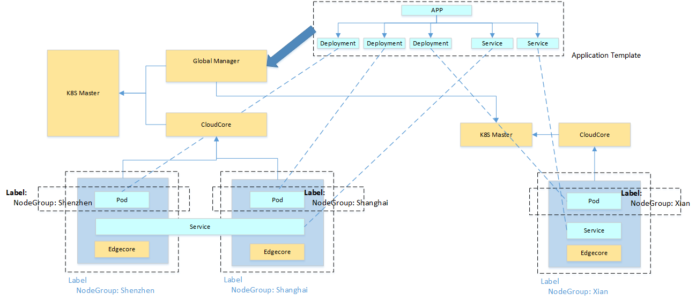
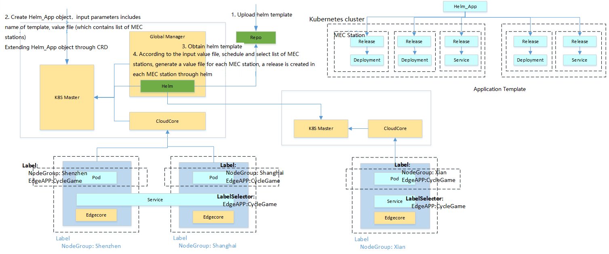
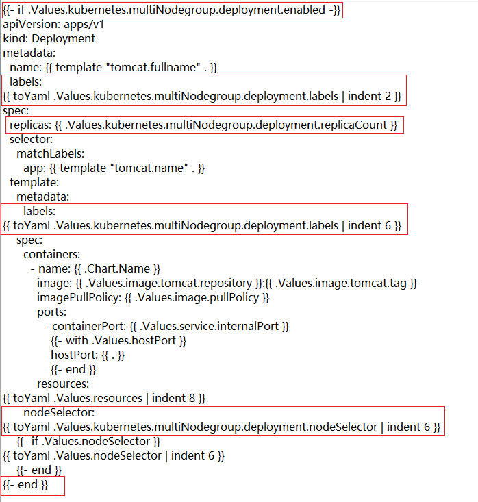
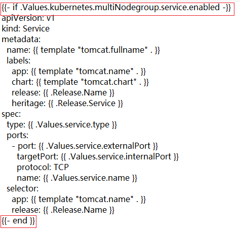
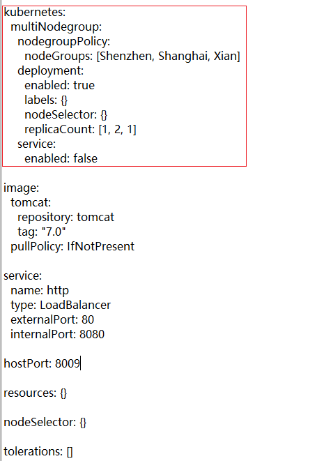

# MEC资源管理与应用管理

## 背景介绍

MEC站点资源有如下的特点：

1. MEC边缘站点通常部署在运营商各个层次的汇聚机房和核心机房，如移动的大区中心、省中心、大城市、地级市、区县的多层次机房，联通的全国中心、省中心、大城市、地级市、区县的多层次机房。
2. 每个MEC边缘站点的节点规模从几个到几百个。
3. 有通用服务器、GPU服务器、一体机等各种异构的服务器。
4. 每个MEC站点内部的节点之间是网络互通的，与其它MEC站点的节点通常不能直接网络互通。

基于KubeEdge的边缘计算平台负责统一管理多层次的MEC资源、全局调度和部署边缘应用、统一管理边缘的微服务、实施灵活的边缘流量治理。

下面分为MEC站点资源管理与应用部署、跨MEC站点的应用管理两部分进行分析和设计

## MEC站点资源管理与应用部署

### Use Case

1. 用户在机房新建立一个MEC站点，在所有的节点上安装Edgecore，把这些节点(1~500个)都纳管到KubeEdge，并归属到一个MEC站点对象进行统一管理

2. 用户在多个机房新建立多个MEC站点，在所有的节点上安装Edgecore，把大量节点(1~5000个)都纳管到KubeEdge，并归属到多个MEC站点对象进行统一管理
3. 用户通过KubeEdge管理面查询MEC站点列表，查看每个MEC站点的详细信息
4. 用户通过KubeEdge管理面查询到每个MEC站点的节点列表，查看到每个节点的详细信息
5. 用户通过KubeEdge管理面把1个应用部署到指定MEC站点
6. 用户通过KubeEdge管理面查询指定MEC站点上已经部署的应用实例列表，查看到应用实例的详细信息

### 方案设计

#### 整体方案

为了在单个Kubernetes集群管理多层次的MEC站点资源，需要提供MEC站点概念，每个MEC站点包含若干node和workload实例。

Kubernetes提供label机制来对node、workload等所有资源进行逻辑分组，并根据label进行条件查询。

KubeEdge基于Label来划分逻辑的MEC站点概念，方案的关键点如下：

1. 使用label把Node资源划分到MEC站点，同一个MEC站点的节点都打上相同的label，包括NodeGroup：MEC站点名字

2. 使用label把workload对象划分到MEC站点，把Pod、deployment、Service等对象都打上相同的label，包括NodeGroup：MEC站点名字

3. 使用nodeSelector或节点亲和性把workload对象部署到指定的MEC站点，部署workload对象时指定MEC站点对应的label，如在nodeSelector字段加上NodeGroup：MEC站点名字的label条件

#### 详细流程

##### 纳管MEC站点的节点

1. 在MEC站点的节点上部署Edgecore，纳管到KubeEdge
2. 重复步骤1，直至MEC站点所有的节点都纳管到KubeEdge
3. 通过Kubectl或Kubernetes API，为节点打NodeGroup：MEC站点名字的label
4. 重复步骤3，直至MEC站点所有的节点都完成打label

##### 查看MEC站点的节点列表

1. 通过Kubectl或Kubernetes API，使用labelSelector条件查询节点列表，labelSelector条件包括NodeGroup：MEC站点名字
2. 通过步骤1返回的结果查看到MEC站点的节点列表，查看每个节点的详细信息，包括NodeGroup等label信息

##### 部署应用到指定的MEC站点

1. 编写Deployment模板，打NodeGroup：MEC站点名字的label，并在nodeSelector加上NodeGroup：MEC站点名字的label条件，或增加节点亲和性条件：NodeGroup=MEC站点名字
2. 通过Kubectl或Kubernetes API，提交deployment模板来部署应用
3. 编写services模板，打NodeGroup：MEC站点名字的label
4. 通过Kubectl或Kubernetes API，提交service模板来创建微服务

##### 查看MEC站点的应用列表

1. 通过Kubectl或Kubernetes API，使用labelSelector条件查询deployment列表，labelSelector条件包括NodeGroup：MEC站点名字
2. 从步骤1返回的结果查看MEC站点上已经部署的deployment列表
3. 通过Kubectl或Kubernetes API，使用labelSelector条件查询service列表，labelSelector条件包括NodeGroup：MEC站点名字
4. 从步骤1返回的结果查看MEC站点上已经部署的微服务列表

###  增强方案(可选)

上述的方案中，部署应用(Deployment等workload)时要同时指定label、nodeSelector或节点亲和性，操作容易出错。

改进方案主要通过admission webhook模块为应用自动添加节点亲和性条件，用户不再需要指定nodeSelector或节点亲和性。

主要的流程：

1. 用户编写deployment模板，打上NodeGroup：MEC站点名字的label，通过Kubectl或Kubernetes API提交deployment模板来部署应用
2. Kubernetes API Server把创建deployment的Http请求转发到admission webhook
3. admission webhook获取deployment的详细信息，如果包含NodeGroup：MEC站点名字的label，则为deployment增加节点亲和性条件(nodeAffinity硬亲和)：NodeGroup=MEC站点名字，并返回修改的Json字符串给Kubernetes API Server

admission webhook作为一个可选的controller，在云上的管理节点进行容器化部署。

admission webhook的主要功能：

1. 提供Rest server，接收来自Kubernetes API Server的http请求
2. 根据http请求包含的对象类型和操作类型进行过滤，只留下deployment等WorkLoads对象的创建和更新操作
3. 从Kubernetes API Server查询请求中deployment的详细信息，如果包含NodeGroup：MEC站点名字的label，则为deployment等WorkLoads对象增加节点亲和性条件(nodeAffinity硬亲和)：NodeGroup=MEC站点名字，并返回修改的PathJson给Kubernetes API Server

### 其它问题

1.为什么不使用namespace来隔离MEC站点

A. MEC站点通常包含资源和应用两种资源，但namespace不能隔离node对象。

B. 如果使用namespace来隔离workload对象，一个MEC站点上只能存在一个namespace及归属这个namespace的workload对象。但一些公司有开发、测试等多个团队，这些团队共同使用一个MEC站点的资源，并且每个团队使用一个namespace来隔离。

2.MEC站点通常会有地理位置信息、网络层次信息，怎么承载

可以通过CRD机制来扩展MEC_Station对象，name=MEC站点名字，通过label等字段来包含地理位置信息、网络层次信息

## 跨MEC站点的应用管理

### Use Case

1. 如分布式监控、探测等应用，需要在多个MEC站点上都部署完全相同的一套应用实例。用户通过KubeEdge管理面，把1个应用部署到指定的多个MEC站点，KubeEdge在每个MEC站点都部署相同的一套应用实例。用户通过KubeEdge管理面API，调整应用实例数量，在每个MEC站点都调整应用实例数量
2. 如云游戏/互动直播/AR/VR等应用，需要在多个MEC站点上部署应用实例，但每个MEC站点上的实例数量需要根据策略来自动调整。用户通过KubeEdge管理面，把1个应用部署到到指定的多个MEC站点，KubeEdge在每个MEC站点根据策略部署不同数量的应用实例。应用实例策略包括：用户设置应用实例数量、根据CPU负载自动调整应用实例数量、根据请求数量自动调整应用实例数量
3. 如云游戏/互动直播/AR/VR等应用，需要在多个MEC站点上部署应用实例，MEC站点列表需要根据策略来自动选择，每个MEC站点上的实例数量需要根据策略来自动调整。用户通过KubeEdge管理面API，指定部署策略来部署1个应用，KubeEdge根据策略来选择多个MEC站点，并在每个MEC站点根据策略部署不同数量的应用实例。MEC站点选择策略：用户设置MEC站点列表、根据需要覆盖的地理范围选择MEC站点列表。应用实例策略包括：用户设置应用实例数量、根据CPU负载自动调整应用实例数量、根据请求数量自动调整应用实例数量     
4. 用户通过KubeEdge管理面，为应用增加一个或多个MEC站点，KubeEdge在新增加的MEC站点部署应用实例
5. 用户通过KubeEdge管理面，为应用删除一个或多个MEC站点，KubeEdge在被删除的MEC站点上删除应用实例
6. 用户通过KubeEdge管理面，调整在指定MEC站点的应用实例数量，KubeEdge在指定MEC站点把应用实例数量调整到期望值

### 方案设计

Kubernetes原生的Deployment等Workloads对象通过Node的label来指定部署条件，需要通过非常复杂的组合条件来实现跨MEC站点的应用部署，无法实现灵活的部署策略，用户的操作难度也很大，无法支撑上述的use case。

#### 整体方案

用户提交需要全局部署的应用请求到全局调度模块，由全局调度模块对应用进行分解、调度和编排，并在多个Kubernetes集群的多个MEC站点分别创建Deployment对象和Service对象。

#### 跨MEC站点的微服务管理

在MEC站点内部Pod可以通过service name直接访问微服务，微服务在各个MEC站点的service name应该是一样的。

方案1：在K8S集群只创建1个service，由Edgecore/Edgemesh提供访问控制机制  (建议)

跨MEC站点的service管理流程：

1. 对于应用定义的一个Service，在Kubernetes集群中创建一个Service实例，在所有MEC站点上部署

2. MEC站点内部Pod可以通过service_name域名直接访问Service实例。由于Service实例对应的后端POD实例分布在多个MEC站点，需要Edgecore/Edgemesh提供访问控制机制。

   对于普通的service，通过service name只能访问到MEC站点内部的后端Pod(通过Endpoint后端Pod的label来区分)。

   对于包含特定label(Cross_Type=Cross_MEC_Station)的service，通过service name能访问到MEC站点内部的后端Pod、其它MEC站点的后端Pod。

问题：一个serivce的后端POD能不能来自多个deployment？  K8S原生可以支持

方案2：在每个MEC站点创建1个Service

问题：由于每个MEC站点的service都是一样的service_name，在K8S集群中有冲突

#### 全局编排和调度

Global Manager作为Kubernetes的一个扩展controller，有一套面向用户的API，主要功能包括:

1. 提供一套应用模板，支持定义跨MEC站点的应用，包括Deployment、Service等workload对象
2. 对应用模板实例进行解析和编排，分解为Deployment、Service等workload对象
3. 根据应用的部署要求进行调度，根据策略在多个MEC站点分别创建Deployment对象和Service对象
4. 负责跨MEC站点应用的生命周期管理，包括创建、查看、更新、删除等
5. 支持多Kubernetes集群

Global Manager有两种API提供方式：

方式1：通过CRD在K8S集群扩展Helm_App对象，Global Manager作为controller来管理Helm_App对象，在K8S API Server提供对外的API

方式2：Global Manager包含独立的API Server，提供对外的API

#####  对象模型

通过helm模板来定义跨MEC站点的应用模板，应用模板包括Deployment、Service、MEC站点选择策略、实例数量控制策略等信息

在每个MEC站点创建1个Release，包含Deployment、configmap、secret等对象

在每个K8S集群创建1个Release，包含Service对象

在Helm模板中，每个K8S对象(Deployment、Service等)都增加enable控制项，通过values文件中的参数来控制每个Release包含的对象，详细见"应用模板"章节

控制项有两种注入方式：

方式1：用户在编写Helm模板时加入控制项

方式2：Global Mananger从Repo获取到Helm模板后，在Helm模板里加入控制项

##### 跨MEC站点的应用调度

应用调度的主要功能：

1. 为应用选择MEC站点列表
2. 为应用在各个MEC站点部署Deployment实例和Service实例
3. 控制应用在各个MEC站点上的Deployment副本数量

支持的MEC站点选择策略：

1. 用户指定MEC站点列表
2. 根据需要覆盖的地理范围选择MEC站点列表 <暂不支持>

支持的实例数量控制策略：

1. 用户设置应用实例数量
2. 根据CPU负载自动调整应用实例数量 <暂不支持>
3. 根据请求数量自动调整应用实例数量 <暂不支持>

##### 应用生命周期管理

提供跨MEC站点应用的生命周期管理，支持创建、查看、更新、删除等操作

查看：查询应用列表、查询应用详情，应用详情包括整体部署状态、在每个MEC站点部署的对象及状态

更新：支持更新MEC站点列表，支持更新在每个MEC站点的实例数

删除：删除在各个MEC站点上部署的对象

详细请见 “API定义” 和 “详细流程” 章节

##### 支持多K8S集群

// TODO

#### 应用模板与API定义

##### 应用模板

templates\deployment.yaml文件

templates\service.yaml文件

values.yaml文件

##### API定义

###### Create Helm_App Instance

POST   v1/helm_app/instances

Body:

{

​	name: ""                    //跨MEC站点应用的名字

​	template_file_url: ""    //跨MEC站点应用helm模板文件包的存储路径

​    values_file_path: ""   //跨MEC站点应用helm模板中values文件的存储路径，用于指定应用实例的参数

}

###### List Helm_App Instances

GET  v1/helm_app/instances

GET  v1/helm_app/instances/{instance_id}

###### Update Helm_App Instances

POST   v1/helm_app/instances/{instance_id}

Body:

{

​    values_file_path: ""   //跨MEC站点应用helm模板中values文件的存储路径，用于指定应用实例的参数

}

当前只支持更新MEC站点列表和在每个MEC站点的实例数

###### Delete Helm_App Instance

DELETE  v1/helm_app/instances/{instance_id}

#### 详细流程

##### 创建应用

1. 按照应用模板规范，用户编写helm模板，上传到Repo
2. 用户编写values文件，包含MEC站点列表、在每个MEC站点的实例数，并通过API来创建应用
3. Global Manager解析values文件，获取MEC站点列表和实例数
4. Global Manager为每个MEC站点生成1份value文件，只启用Deployemt对象，并设置Deployemt的副本数、label、nodeSelector，通过helm在每个MEC站点创建1个Release，
5. Global Manager为每个K8S集群生成1份value文件，只启用Service对象，通过helm在每个K8S集群创建1个Release
6. Global Manager把应用部署状态、MEC站点列表、在每个MEC站点的实例数、Release列表、values文件等信息存放到DB/ETCD

##### 查看应用

1. 用户通过API查看应用列表
2. Global Manager从DB/ETCD中获取应用部署状态、MEC站点列表、在每个MEC站点的实例数、values文件等信息
3. Global Manager通过helm获取每个Release的信息，包括部署的对象及状态
4. Global Manager封装应用的详细信息，并返回

##### 更新应用

1. 用户编写values文件，包含更新后的MEC站点列表、在每个MEC站点的实例数，并通过API来更新应用
2. Global Manager解析values文件，获取MEC站点列表和实例数
3. Global Manager从DB/ETCD中获取应用部署状态、MEC站点列表、在每个MEC站点的实例数、Release列表、values文件等信息，与提供的信息进行对比。
4. Global Manager为新增加的每个MEC站点生成1份value文件，只启用Deployemt对象，并设置Deployemt的副本数、label、nodeSelector，通过helm在每个MEC站点创建1个Release
5. Global Manager为被删除的每个MEC站点，调用helm删除对应的Release
6. Global Manager为实例数变化的每个MEC站点生成1份value文件，只启用Deployemt对象，并设置Deployemt的副本数、label、nodeSelector，通过helm更新对应的Release

##### 删除应用

1. 用户通过API删除应用
2. Global Manager从DB/ETCD中获取应用部署状态、MEC站点列表、在每个MEC站点的实例数、Release列表、values文件等信息
3. Global Manager调用helm来删除所有的Release

